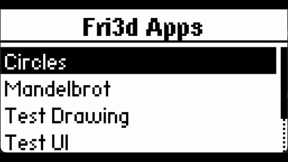

# Fri3d WASM Badge

A Rust-based WebAssembly badge platform for the Fri3d camp badge, featuring a 128x64 OLED display. Includes a desktop emulator, web emulator, and a growing set of WASM apps.



### **[Try the Live Demo](https://fdb.github.io/fri3d-wasm-badge/)**

## Getting Started

### Prerequisites

- Rust toolchain (via rustup)
- wasm32 target:

```bash
rustup target add wasm32-unknown-unknown
```

Optional (tests and web):
- uv (for Python test runners)
- Node.js (for web smoke tests)

Linux desktop build dependencies (minifb):

```bash
sudo apt-get install -y libx11-dev libxrandr-dev libxcursor-dev libxinerama-dev libxi-dev
```

## Building

### Quick Build (All Components)

```bash
./build_all.sh
```

### Desktop Emulator Only

```bash
./build_emulator.sh
```

### WASM Apps Only

```bash
./build_apps.sh
```

### Web Emulator

```bash
./build_web.sh
```

## Running the Emulator

```bash
# Run launcher.wasm
./target/release/fri3d-emulator

# Run a specific app
./target/release/fri3d-emulator build/apps/circles/circles.wasm
```

## Controls

- Arrow keys: Navigate
- Z / Enter: OK / Select
- X / Backspace: Back
- S: Screenshot (writes screenshot_<n>.png)
- Left + Back (hold 500ms): Return to launcher

## Running Tests

```bash
# Run all visual tests
uv run tests/visual/run_visual_tests.py

# Update golden images
uv run tests/visual/run_visual_tests.py --update-golden
```

### Trace Integration Tests

```bash
# Build trace harness + WASM apps and run trace tests
./build_trace_tests.sh
```

#### Updating Golden Traces

Some specs use `expected_mode: "exact"` and compare against golden traces in
`tests/trace/expected/<app>/<spec>.json`. To update them after intentional app changes:

```bash
# Run trace tests to generate new outputs
./build_trace_tests.sh

# Copy a specific trace to the expected location
cp tests/trace/output/<app>/<spec>.json tests/trace/expected/<app>/<spec>.json
```

## Project Structure

```
fri3d-runtime/        # Shared runtime (canvas, input, wasm runner, trace)
fri3d-emulator/       # Desktop emulator (minifb)
fri3d-web/            # Web host (wasm32 + JS shell)
fri3d-wasm-api/        # WASM SDK for Rust apps
fri3d-app-*/          # Rust WASM apps
fri3d-trace-harness/  # Trace test harness
specs/                # Specs for the Rust port
tests/                # Visual, trace, and web tests
```

## Dependencies

- Rust toolchain (stable)
- wasm32-unknown-unknown target
- Optional: uv, Node.js (for tests)

## License

See individual crate licenses where applicable.
