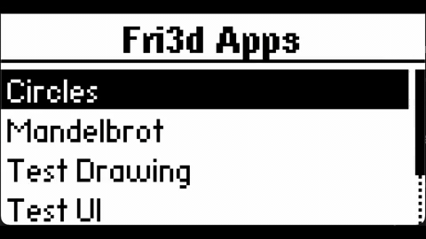

# Fri3d WASM Badge

A WebAssembly runtime for the [Fri3d Camp 2024 badge](https://github.com/Fri3dCamp/badge_2024_hw)
(ESP32-S3, 240×296 color LCD). Rust apps compile to WASM and run on the
real hardware via wasm3, in the browser via Emscripten, and natively for
offline testing — all from the same C++ host.



### **[Try the Live Demo in your Browser](https://fdb.github.io/fri3d-wasm-badge/)**

## Architecture

```
┌─────────────────────────────┐
│  Rust app (fri3d-app-*)     │  compiles to wasm32-unknown-unknown
│  + fri3d-wasm-api SDK       │  (the 24 host functions the app imports)
└───────────┬─────────────────┘
            │ .wasm
            ▼
┌─────────────────────────────────────────────────────────────┐
│  C++ host in firmware/src (canvas, random, wasm_host, font) │
│  ─ shared across three targets ─                            │
└───────┬──────────────┬──────────────┬─────────────────────────┘
        │              │              │
        ▼              ▼              ▼
 ESP32-S3 badge    browser       native CLI
 (PlatformIO)      (Emscripten)  (app-runner, parity tests)
```

Canvas primitives are kept **byte-exact** with the Rust reference
implementation in `fri3d-runtime/src/canvas.rs` via a parity test harness —
see [CLAUDE.md](CLAUDE.md) for details.

## Prerequisites

- Rust toolchain (via rustup) with `wasm32-unknown-unknown` target
- `wasm-opt` ([binaryen](https://github.com/WebAssembly/binaryen)) for shrinking app WASM
- [PlatformIO](https://platformio.org/install) for the badge firmware
- [Emscripten](https://emscripten.org/) for the browser build
- `uv` (Python runner) for optional parity sweeps

```bash
rustup target add wasm32-unknown-unknown
brew install binaryen emscripten
```

## Building & running

### Browser emulator (fastest feedback loop)

```bash
firmware/web/build.sh
cd firmware/web/dist && python3 -m http.server 8080
# open http://localhost:8080/
```

### Hardware firmware

```bash
cd firmware
pio run                 # build
pio run -t upload       # flash (requires USB-C to the badge)
```

### Native app runner (offline rendering to PNG)

```bash
firmware/tools/app-runner/build.sh
firmware/tools/app-runner/app_runner firmware/build/fri3d_app_circles_opt.wasm \
    --out /tmp/circles.png
```

## Tests

### Canvas parity (C++ vs Rust reference)

```bash
firmware/tools/canvas-parity/run.sh
```

Regenerates Rust-side golden framebuffers, builds the C++ tester, and
diffs byte-for-byte. Fails loudly on any drift.

### Visual parity (full apps)

```bash
firmware/tools/app-runner/visual_parity.sh
```

Runs every app that has a Rust-generated `tests/visual/apps/<app>/golden/*.png`
through the native C++ runner and compares pixel-for-pixel.

## Controls (hardware & browser)

- D-pad / WASD / arrow keys: navigate
- A / Z / Enter: OK / Select
- B / X / Backspace: Back

## Project structure

```
firmware/
  src/                 # Shared C++: canvas, random, wasm_host, font, fonts
  lib/wasm3/           # Vendored wasm3 v0.5.0
  web/                 # Emscripten browser build (index.html, test.html, tests.js)
  tools/
    app-runner/        # Native WASM runner, dumps PNG
    canvas-parity/     # C++ parity tester
  platformio.ini       # Hardware build config
  scripts/embed_app.sh # Rust app -> optimized embedded_app.h

fri3d-runtime/         # Canvas/Random reference (used only by parity-gen)
fri3d-wasm-api/        # App SDK — 24 host imports
fri3d-app-*/           # Rust WASM apps

tools/
  canvas-parity-gen/   # Rust binary that emits golden framebuffers
  transpile_fonts.py   # One-shot fonts.rs → fonts.h extractor

tests/
  canvas-golden/       # Golden framebuffers for primitive tests
  visual/apps/         # Golden PNGs for full-app visual parity
```

## License

See individual crate licenses where applicable.
