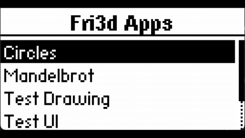

# Fri3d WASM Badge

A Rust kernel that runs WebAssembly apps on the
[Fri3d Camp 2026 badge](https://github.com/Fri3dCamp/badge_2026_hw)
(ESP32-S3, 320×240 LCD), in a desktop window, and in the browser — the
same kernel bytes on all three. Apps are Rust crates compiled to
`wasm32-unknown-unknown`, each with a manifest and an icon, shown by a
Flipper-Zero-style launcher.



## Architecture

```
apps/<id>/                 Rust app crate + manifest.toml + icon.png
   │  cargo build --target wasm32-unknown-unknown
   ▼
tools/fri3d-pack           → build/apps/<id>.fab   (256-byte header + wasm)
   │                       → fri3d-apps/src/generated.rs (include_bytes!)
   ▼
fri3d-kernel  (no_std)     canvas · input · registry · settings · lifecycle · wasmi host
   │
   ├── hosts/desktop       minifb window, headless screenshot tool
   ├── hosts/web           wasm-bindgen + <canvas>, Playwright-testable harness
   └── hosts/badge         esp-hal (no_std) firmware for the ESP32-S3 badge
```

Design notes and lessons learned live in [design_docs/](design_docs/README.md).
The C++ firmware under `firmware/` is the previous implementation, kept
as a reference for canvas parity; it is not built by default.

## Display

Apps draw on a **160×120 monochrome canvas**. Hosts upscale it: 2× to the
full 320×240 badge LCD, 4× on desktop and web, black pixels on a Flipper-style
amber background.

## Prerequisites

```bash
rustup target add wasm32-unknown-unknown
brew install binaryen            # wasm-opt, optional: smaller app bundles
cargo install wasm-pack          # browser host
cargo install espflash           # badge host
```

The badge host needs the Espressif Rust toolchain (`espup install`);
see [hosts/badge/README.md](hosts/badge/README.md).

## Build and run

```bash
# 1. Pack every app in apps/ (builds them, writes build/apps/*.fab).
cargo run -p fri3d-pack

# 2a. Desktop window.
cargo run --release -p fri3d-host-desktop

# 2b. Headless: scripted input + screenshot, for tests and CI.
cargo run --release -p fri3d-host-desktop -- \
    --headless --app snake --keys ok,down,down --frames 3 --screenshot out.png

# 2c. Browser.
hosts/web/build.sh
cd hosts/web/dist && python3 -m http.server 8091   # open /  or /test.html

# 2d. Badge (USB-C attached).
hosts/badge/flash.sh
```

Desktop and web keys: arrows / WASD = d-pad, `Z` / Enter = OK,
`X` / Backspace = Back, `M` / Esc = Menu (home). `F12` saves a screenshot
on desktop.

## Writing an app

```
apps/hello/
  Cargo.toml       crate-type = ["cdylib"], depends on fri3d-wasm-api
  manifest.toml    id, name, version, author, description, category, icon
  icon.png         14×14, dark pixels = set
  src/lib.rs       export_render!, export_on_input!, optional lifecycle exports
```

Add the crate to the workspace `members`, run `cargo run -p fri3d-pack`,
and the app appears in every host. See
[design_docs/007-app-api-guidelines.md](design_docs/007-app-api-guidelines.md)
for the API and the performance rules it encodes.

## Tests

```bash
cargo test -p fri3d-kernel        # unit + lifecycle tests (WAT apps, fuel, settings policy)
hosts/web/build.sh && ...          # open /test.html, read window.testResults
firmware/tools/canvas-parity/run.sh   # C++ reference canvas vs the kernel canvas
```

## Project structure

```
fri3d-kernel/        The kernel. no_std + alloc. wasmi host, lifecycle, limits.
fri3d-wasm-api/      App SDK: safe wrappers over the `env` imports, IMGUI, lifecycle macros.
fri3d-apps/          Generated embed crate (LAUNCHER + APPS slices).
apps/                One folder per app: launcher, settings, snake, mandelbrot, …
hosts/desktop/       minifb host + headless screenshot tool (`fri3d`).
hosts/web/           wasm-bindgen host, index.html harness, test.html suite.
hosts/badge/         esp-hal firmware (separate workspace, Xtensa toolchain).
tools/fri3d-pack/    manifest + icon + wasm → .fab bundles + generated.rs.
tools/canvas-parity-gen/  Golden framebuffers for the C++ reference parity test.
design_docs/         Lessons learned and decisions.
specs/               Earlier stage specs (historical).
firmware/            Previous C++ implementation (reference only).
```

## License

See individual crate licenses where applicable.
